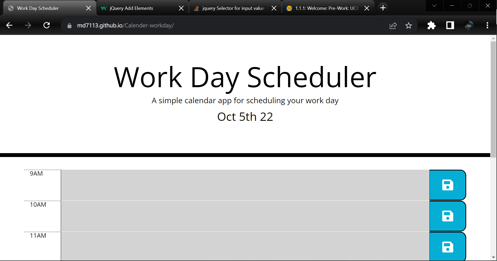

# Calender-workday


## Deployed link
* [Calendar](https://md7113.github.io/Calender-workday/)

## site picture



## Technologies Used
- HTML : Used to format the content of the page
- CSS : Used to style the HTML on the web browser
- JavaScript : Used to give the page logical functions and a dynamic interface
- Git : Used to version control the code during the creation process
- GitHub : hosting the repositroy responsible for the website

## Authors
- baseline header content and styling options by unknown author
-coding styling and content was writen and produced by Mason Davis

## summary
This repository contains all the code for a calendar meant to display different styling based on the time of day and save data for each user when they get on.

## Code Snippet
This is a snippet Showing the formula used to apply different classes based on the time of day, it worked hand in hand with another that stripped the class and reassigned it every min.

```javaScript
for(i=9;i<18;i++){
    if(i<hour){
    $("#"+i).addClass("past")
    }
    if(i>hour){
        $("#"+i).addClass("future")
    }
    if(i==hour){
    $("#"+i).addClass("present")
    }}
```


## Author links
[LinkedIn](https://www.linkedin.com/in/davis-mason-t/)
[GitHub](https://github.com/Md7113)